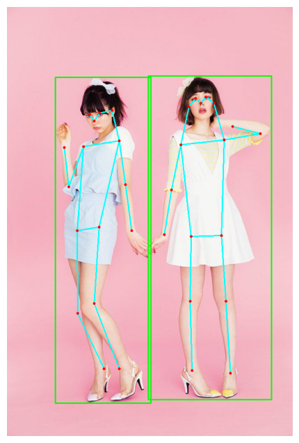
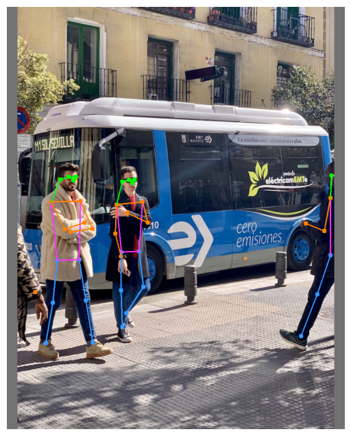
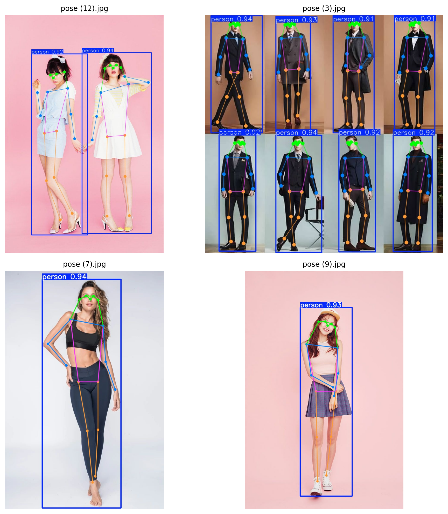

    <h1>Pose Estimation using YOLO NAS POSE vs   YOLOv7 vs v8 vs v11</h1>

    <h3>YOLO NAS POSE vs YOLOv7 </h3>

 

    <h3>YOLOv8 vs YOLOv11 </h3>

 

---

## 🏗️ Methodology

- 🤸‍♂️ Pose Estimation Model1: **yolo_nas_pose_l_coco_pose.pth**
- 🤸‍♂️ Type: **Bottom-up**
- 🤸‍♂️ Framework: **PyTorch + onnxruntime**
- 🤸‍♂️ Pose Estimation Model2: **yolov7-w6-pose.pt**
- 🤸‍♂️ Type: **Bottom-up**
- 🤸‍♂️ Framework: **PyTorch**
- 🤸‍♂️ Pose Estimation Model3: **yolov8l-pose.pt**
- 🤸‍♂️ Pose Estimation Model4: **yolo11l-pose.pt**
- 🤸‍♂️ Type: **Bottom-up**
- 🤸‍♂️ Framework: **PyTorch + Ultralytics**

---

## ⭐ Acknowledgements

- onnxruntime

---
